# Matched-filter detection of faint moving objects

`RMS.MatchedFilterDetection` finds moving objects which are too faint to be seen in single frames of
frame-based video (e.g. UWO `.vid` files, other video files, directories of FITS frames). The normal detection
needs an object to stand out in a single frame, at least about 5 times the noise. The matched filter instead adds
the frames along every possible motion of an object, so a faint object adds up while the noise averages out, and
finds objects down to about 1.5 times the noise per frame (about 2 magnitudes fainter). It runs as a separate pass
after the normal detection, as a replacement of it, or on its own from the command line.

Only the measurements made on clear sky are kept: the stars of every chunk of frames are compared with their
clear-sky brightness, and the regions and times where clouds dim or hide them are left out, as the positions and
magnitudes measured there can't be trusted.

This guide assumes you know the monitor (see [MonitorProcessing.md](MonitorProcessing.md)).

- [Overview](#overview)
- [The idea: adding the frames along a motion](#the-idea-adding-the-frames-along-a-motion)
- [The steps in detail](#the-steps-in-detail)
- [Clear sky](#clear-sky)
- [What is processed](#what-is-processed)
- [Output](#output)
- [Running it](#running-it)
- [Tests](#tests)
- [Settings](#settings)
- [Limits](#limits)


## Overview

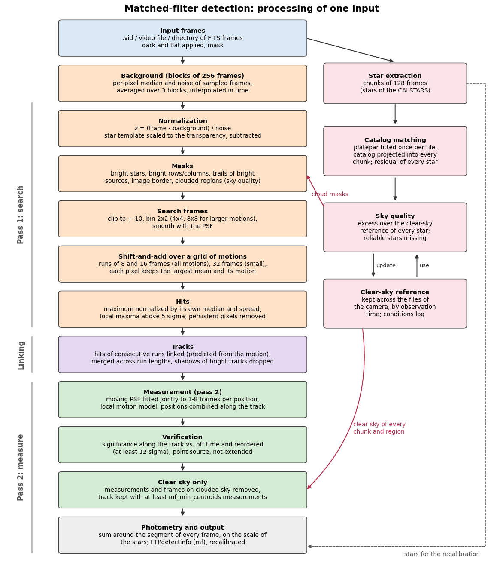

An input (a video file or a directory of FITS frames) is processed in two passes over its frames:

1. **Search.** The frames are normalized to unit noise, the static sources (stars) and the clouded regions are
   masked, and short runs of frames are added along a grid of motions. Every pixel keeps its largest sum over the
   motions; the peaks above the threshold are the *hits*.
2. **Linking.** The hits of consecutive runs are linked into candidate tracks.
3. **Measurement.** Every candidate track is measured on the full-resolution frames: a moving PSF is fitted to as
   few frames as needed for a position error of about 0.5 px. The track is then verified (its signal must belong to a
   moving point source), the measurements on clouded sky are removed, and the photometry of every frame is
   measured.

In parallel, the stars are extracted from chunks of 128 frames (as for the normal detection) and matched to the
star catalog; they give the sky quality of every chunk and region (see [Clear sky](#clear-sky)) and the
recalibration of the detections.


## The idea: adding the frames along a motion

### Normalized frames

Every frame is turned into a frame of unit noise:

$$z_k(x, y) = \frac{f_k(x, y) - b(x, y)}{\sigma(x, y)}$$

where $f_k$ is the frame $k$, $b$ the background (the median of the frames around it) and $\sigma$ the noise of
every pixel (from the median absolute deviation). A pixel of pure noise is then a draw from a distribution of zero
mean and unit spread, in every part of the image, whatever its brightness. An object whose PSF peaks at $A$ times
the noise is a bump of height $A$.

### Adding the frames along a motion

An object moving with the motion $\mathbf{v} = (v_x, v_y)$ px per frame, which is at the position $\mathbf{p}$ at the
middle time of a run of $N$ frames, is at $\mathbf{p} + \mathbf{v}\,\Delta t_k$ in the frame $k$, with
$\Delta t_k = k - (N - 1)/2$ the time of the frame relative to the middle of the run. Shifting every frame back by
$\mathbf{v}\,\Delta t_k$ (rounded to whole pixels) and averaging:

$$S_\mathbf{v}(\mathbf{p}) = \frac{1}{N} \sum_{k=0}^{N-1} z_k(\mathbf{p} + \mathbf{v}\,\Delta t_k)$$

The object adds up at $\mathbf{p}$ ($S = A$), while the noise of the $N$ frames is independent and averages out
(its spread is $1/\sqrt{N}$), so the signal-to-noise ratio of the stack is

$$\mathrm{SNR} = A \sqrt{N}$$

An object at 1.5 sigma per frame is at 6 sigma in a run of 16 frames. Along any other motion, the object is smeared
over the run and doesn't add up:

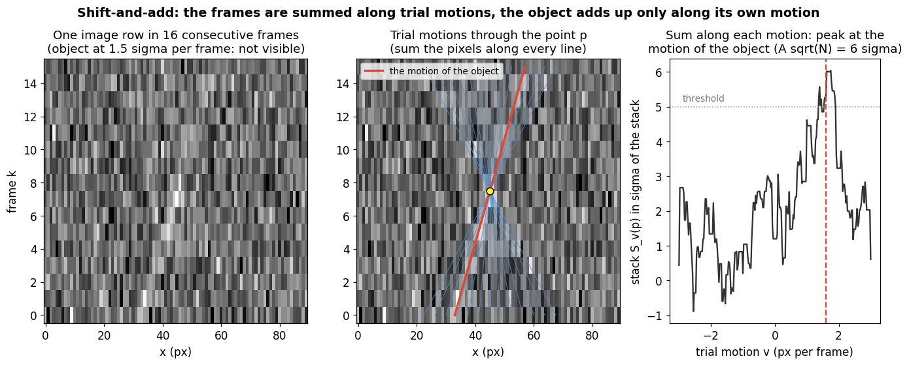

The left panel is one row of the image in 16 frames (time upwards): the object at 1.5 sigma per frame can't be seen.
The middle panel shows trial motions through one point; along the motion of the object (red) its pixels add up.
The right panel is the sum along every trial motion: it peaks at the motion of the object.

The same in two dimensions, with 16 frames of an object at 1.5 sigma per frame:

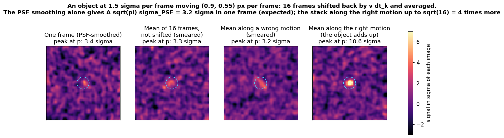

### Smoothing with the PSF: a matched filter

Before adding, every frame is smoothed with the PSF (a Gaussian of the PSF sigma, at least 1 px). For frames of unit
noise, the optimal (matched-filter) estimate of the amplitude of a point source of PSF $g$ at a known position is

$$\hat{A} = \frac{\sum g\,z}{\sum g^2}, \qquad \mathrm{SNR} = \frac{\sum g\,z}{\sqrt{\sum g^2}}$$

so smoothing with the PSF already gives a point source of a Gaussian PSF of sigma $\sigma_\mathrm{PSF}$ the
signal-to-noise ratio $A \sqrt{\pi}\,\sigma_\mathrm{PSF}$ in one frame (3.2 sigma above), and the stack along the
right motion multiplies it by up to $\sqrt{N}$. The frames are also binned 2x2 (the sum of the 4 pixels divided by
2, which keeps the noise of a binned pixel 1 and all the signal of a point source): this is most of the smoothing
for the small PSFs of these cameras, and it makes the search 4 times faster.

### The grid of motions

The motion of a faint object is not known, so the stack is computed for a grid of motions, and every pixel keeps
the largest stack over the motions and the motion which gave it. An object whose motion differs by $dv$ from the
nearest motion of the grid drifts by $dv\,(N - 1)/2$ at the first and the last frame of the run. The grid step is
$1/(N - 1)$ binned px per frame, so the nearest motion is at most half a step away in each axis and the drift is at
most 1/4 px: the object stays within the PSF in the whole stack.

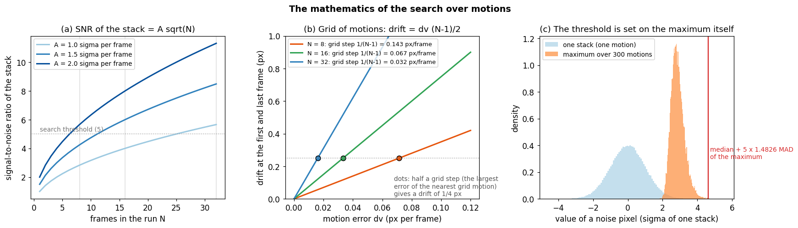

(a) The signal-to-noise ratio of the stack grows with the square root of the number of frames. (b) The drift of an
object between the grid points: the grid step makes it at most 1/4 px for every run length. (c) The largest of many
stacks of pure noise is not distributed like one stack: it is shifted up and narrower. The threshold is therefore
set on the distribution of the maximum itself, over the whole image: the maximum is normalized by its median and
its robust spread (1.4826 times the median absolute deviation), so `mf_threshold` (5) is in units of the actual
noise of the maximum, for any number of motions.

### Runs of frames and tiers of motions

- Runs of 8 and 16 frames (`mf_run_frames`) are searched for all motions up to the largest one (`mf_ang_vel_max`,
  converted to px per frame with the plate scale and the frame rate). Runs of 32 frames (`mf_slow_run_frames`) are
  searched for the motions of up to 4 binned px over the run (0.25 px per frame on 2x2 bins), where the longer
  run reaches deepest.
- The number of motions grows with the square of the largest motion in binned px per frame. Objects moving several
  pixels per frame are long in every frame anyway, so the larger motions are searched on coarser bins (*tiers*):
  the motions up to `mf_tier_speed` (2) binned px per frame on 2x2 bins, the next ones on 4x4 bins, and so on up to
  `mf_max_bin` (8). A coarser bin adds the noise of more pixels to a point source (about 0.4 mag less deep for 4x4
  instead of 2x2 bins with a PSF sigma of 0.75 px), so only the motions which need it are searched there.

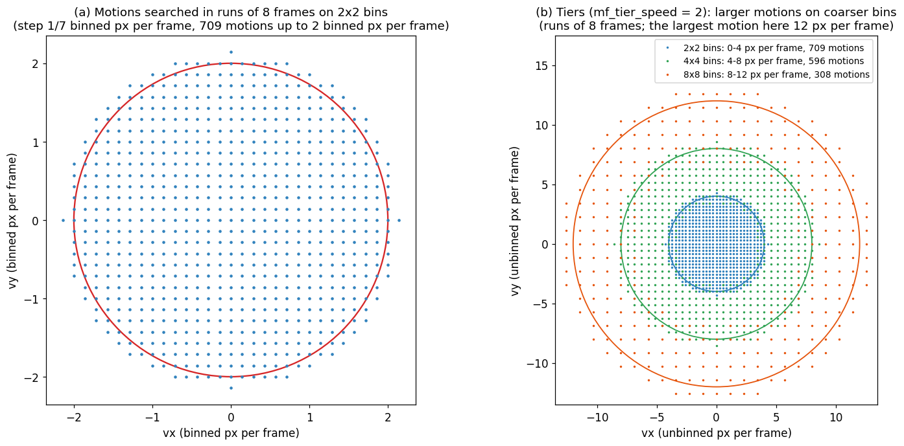


## The steps in detail

### 1. Frames

The frames are read with the dark and the flat applied and the mask, in blocks of `mf_block_frames` (256)
frames. UWO `.vid` files have a timestamp in every frame, which gives the frame times and the measured frame rate.
Directories of FITS frames have the time of every frame in `DATE-OBS`, but their frame rate is the one of the
config (`fps`): it converts the range of motions (`mf_ang_vel_max`) to px per frame, so it has to be set right.
The saturated pixels of the raw frames (above `mf_saturation_level`, or 98% of the bit range) are kept as a mask.

### 2. Background and normalization

- **Background.** For every block, the per-pixel median and noise (1.4826 times the median absolute deviation) of
  every 4th frame. The median of one block has a noise of about 0.15 of the noise of a frame, which would make faint
  static patterns when summed over many frames, so it is averaged over the neighbouring blocks (three blocks), and
  the background of every frame is interpolated linearly in time between the middles of the blocks.
- **Transparency.** The brightness of the stars changes with the transparency of the sky (by several times within
  a minute in thin clouds). The stars of the median above the local sky are a *star template*; in every frame, the
  change of the template which fits the frame best is subtracted, so the stars don't leave residuals when the sky
  changes.
- **PSF.** The PSF sigma is measured on bright isolated stars of the first block in which enough of them are seen
  (or set with `mf_psf_sigma`).

### 3. Masks

The pixels which are left out of the search and the measurement:

- **Stars.** The sources of the median brighter than `mf_star_threshold` (3) times the noise of the sky in one
  frame, grown by a pixel. Fainter stars are taken out by the star template.
- **Bright rows and columns.** Rows and columns of the median brighter than their neighbours (the trails of very
  bright stars along their row and column, bad columns): they flicker as a whole, which the stacks along them would
  add up.
- **Trails of bright moving sources.** On some sensors a very bright source leaves a faint trail along its whole
  row and column. The trails move with the source and would be found as objects, so in every frame the rows and
  columns of the sources brighter than `mf_trail_level` (25 times the noise) are left out, except at the source.
- **The image border** (`mf_edge_margin`, 8 px) and the user mask.
- **Clouded regions** of the chunks of frames overlapping the block (see [Clear sky](#clear-sky)).

### 4. Search

Every frame is clipped to +-`mf_clip` (10) (single-pixel outliers: cosmic rays, scintillating stars; a faint object
is never that bright in one frame), binned and smoothed with the PSF, and the runs of frames are stacked along the
grid of motions (on the GPU if available). The maximum over the motions is normalized as described above, and its
local maxima above `mf_threshold` within +-4 unbinned px are the hits: a position at the middle time of the run and
the motion of the best stack.

- **Persistent pixels.** Pixels above the threshold in more than `mf_persistence` (20%) of all runs of the input
  are flickering or variable sources, and their hits are removed.
- **Objects which move very little.** An object which stays on the same pixels for more than half a block is part
  of the median of the block (the background) and masked as a star. For these, the median of every block is compared
  with the medians of blocks a few blocks before and after it, shifted by the motion of the stars (e.g. the diurnal
  motion of a fixed camera, measured by phase correlation of the medians): the stars cancel, and an object which moves
  relative to them is found and linked from block to block. Its background is estimated again without it before it
  is measured.

### 5. Linking, merging and shadows

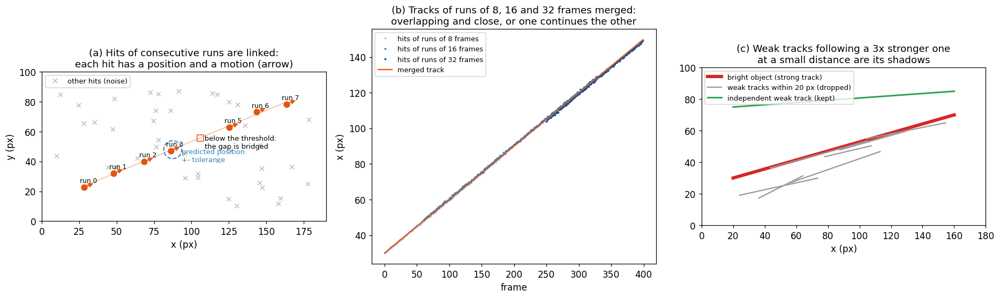

- **Linking.** Chains start from the strongest hits and grow forward and backward in time. The next hit is
  predicted from the motion of the chain (a line fitted to its hits, or the motion of the hit for a single hit); it
  has to be within the uncertainty of the prediction (1.5 binned px, plus 1.5 grid steps times the time) and have a
  similar motion. A chain can skip up to 3 runs in which the object is below the threshold.
- **Strong hits.** A hit stronger than 3 times the threshold can come from a single bright frame of its run (an
  object whose brightness changes quickly), whose motion is then not known: strong hits are linked by their
  positions, also across gaps of up to `mf_link_max_gap` (96) frames.
- **Merging.** The tracks of runs of 8, 16 and 32 frames, and pieces of one track, are merged: two tracks are the
  same object if they overlap in time and their interpolated positions are within 2 binned pixels (median), or if
  one begins where the other one, extrapolated over the gap, ends (gaps of up to 4 runs of 32 frames).
- **Shadows.** The hits around a very bright object (its wings, its trails, the noise it adds) link into tracks of
  their own. A track which stays within 20 px of a track at least 3 times stronger for at least 80% of its hits,
  moving the same way, is dropped.
- **Acceptance.** A track needs `mf_min_hits` (3) hits, a motion within the range, and a displacement of at least
  `mf_min_displacement` (3) FWHMs (the residuals of variable stars don't move). At most `mf_max_tracks` (300) tracks
  are measured, the strongest ones, so an input in bad conditions can't take much longer than usual.

### 6. Measurement

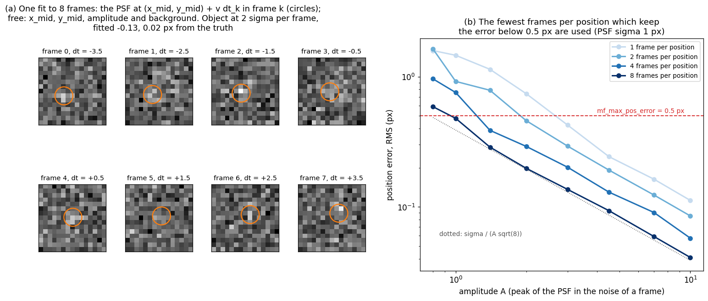

Every track is followed through the full-resolution frames with a local motion model (positions and motion from the
hits nearby, extrapolated from the accepted measurements beyond them), so curved tracks (lens distortion) are
measured too. At every position, a moving PSF is fitted jointly to $n$ frames: in frame $k$ the model is

$$m_k(i, j) = b + A \, G_k(i, j)$$

where $G_k$ is the PSF (peak 1) at $(x_\mathrm{mid}, y_\mathrm{mid}) + \mathbf{v}\,\Delta t_k$, smeared along the
segment the object moves along during the frame. The motion $\mathbf{v}$ is fixed from the track and the PSF width
is fixed; the free parameters are the position at the middle time $(x_\mathrm{mid}, y_\mathrm{mid})$, the amplitude
$A$ and the background $b$ (Levenberg-Marquardt). Fitting all frames jointly uses all the light of the object, like
the stack, but at the full resolution and without rounding the shifts. The position error of an object of amplitude
$A$ over $n$ frames is about $\sigma_\mathrm{PSF}/(A\sqrt{n})$.

- **Frames per position.** The track is first fitted with 8 frames; from its error, $n$ is doubled from 1 until the
  expected error is below `mf_max_pos_error` (0.5 px), up to `mf_max_measure_frames` (8). Bright objects get a
  position in every frame, faint ones one per 8 frames.
- **Acceptance of a measurement.** The amplitude has to be at least `mf_min_sample_snr` (3) times its error, and the
  position error (scaled by `mf_sigma_scale`, 1.3, to the errors measured on objects added to recorded frames) within
  twice the limit. Measurements on masked stars are not used, and outliers from the motion model are removed. A track
  needs `mf_min_centroids` (6) measurements.
- **Combined positions.** The positions are combined over +-`mf_smooth_frames` (64) frames with a weighted local
  quadratic fit of the track, which reduces their errors 2 to 5 times (the positions of nearby measurements are then
  correlated; 0 disables it).

### 7. Verification

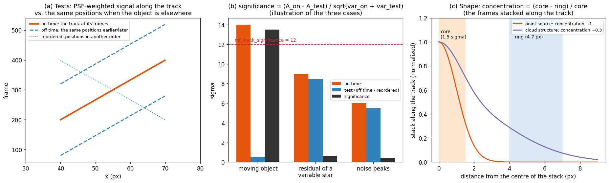

The candidate tracks include tracks made of noise peaks and tracks along the residuals of static sources. For every
track, the PSF-weighted sums $\sum g z$ and $\sum g^2$ are taken along a smooth track through its measurements in
every frame (*on time*), and at the same positions at times when the object is elsewhere: the same positions earlier
and later by the time in which the object moves 3 PSF widths, at least 16 frames (*off time*), and the positions in
4 other orders (*reordered*). The amplitude on time $A_\mathrm{on}$ and in the test $A_\mathrm{test}$ give the
significance

$$s = \frac{A_\mathrm{on} - A_\mathrm{test}}{\sqrt{\mathrm{var}_\mathrm{on} + \mathrm{var}_\mathrm{test}}}$$

the signal-to-noise ratio of the track with the signal of static sources at its positions subtracted. A detection
needs $s \geq$ `mf_track_significance` (12) in both tests (the smaller of the two is its significance). A moving
object has signal only on time; a residual of a star has the same signal at all times; noise peaks don't stay on a
smooth track. The pixels on stars are left out of the sums.

**Shape.** The frames are also stacked along the track. The light of a point source is concentrated at the centre;
the structures of thin clouds lit from below, drifting across the field, are extended:

$$c = \frac{\text{mean in the core (1.5 PSF sigmas)} - \text{mean in a ring (4–7 px)}}{\text{mean in the core}}$$

Objects are at 0.87–1, cloud structures at 0.2–0.7. A detection below 0.6 is rejected, and one below 0.8 if other
candidate tracks move with it (cloud structures move together). The frames on clouded sky are left out of the stack.
Very significant detections (above 200) are not tested: a very bright object is spread by its own trails.

### 8. Clear sky

The measurements on clouded sky are removed: first the fitted positions (and the track if fewer than
`mf_min_centroids` are left), then the frames of the light curve. See [Clear sky](#clear-sky).

### 9. Photometry

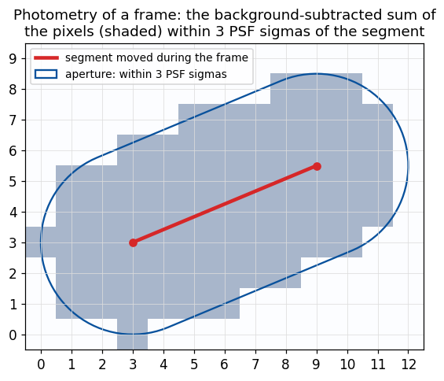

The intensity of every frame along the track is measured, also of the frames whose position was not measured on its
own (e.g. between short brightenings), so the light curve has the full time resolution. It is the sum of the
background-subtracted pixels within 3 PSF sigmas of the segment the object moved along during the frame (a
"stadium"; a circle would cut off the ends of a streak).

- **On the scale of the stars.** The stars are measured with the same aperture on the mean of the frames, and the
  median ratio of their CALSTARS intensities to these sums puts the intensities on the scale of the photometric
  calibration (the factor is in the done file).
- **Saturation.** Saturated pixels are left out of the position fits and counted. A very bright object spills its
  charge along its row and column before its pixels saturate: where the sum within 12 px is more than 1.3 times the
  normal sum (for sums above 100 times their noise), the wider sum is the intensity and the frame counts as
  saturated.


## Clear sky

The positions and magnitudes of the measurements made through clouds can't be trusted, so the matched filter
leaves out the clouded sky, region by region and chunk by chunk. Clouds are found from the photometry of the stars,
not from their number: under a cloud lit from below the stars are about 1 mag fainter, but still extracted in nearly
the same numbers.

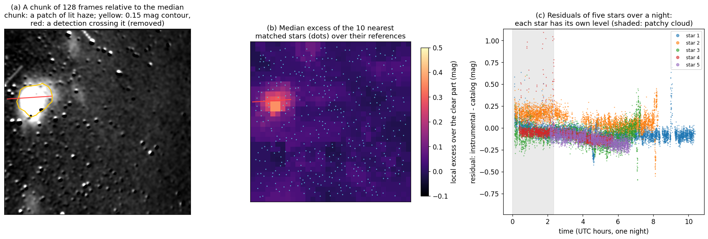

### Stars matched to the catalog

- The stars of every chunk of 128 frames (the star extraction of the normal processing) are matched to the star
  catalog. The platepar is fitted once per input, on the chunk with the most stars (or the next two, if the fit
  fails), and the catalog is projected into every chunk at its time.
- A star is matched if exactly one catalog star is within 1 px (and no other within 3 px: blends have wrong
  intensities), and if it has no saturated pixels. Its *residual* is its instrumental magnitude minus the catalog
  magnitude, corrected for the vignetting and the extinction.
- The catalog stars are selected by their angular distance from the centre of the field at times spread over the
  input (also the stars which enter the image during a long input), which also leaves out the stars far outside the
  field which the distortion of the platepar folds back into the image.
- A calibration which matches fewer than `mf_cloud_min_matched` (30) stars, or 15% of the stars, of the chunk it was
  fitted on is not trusted.

### The clear-sky reference of every star

On clear sky the residual of a star changes by 0.04–0.05 mag from chunk to chunk, but it differs from star to star by
0.10–0.12 mag (the errors of the catalog magnitudes, and the colours of the stars). Every star is therefore compared
with its own reference:

- The residual of a star in an input is the 25th percentile of its residuals there (at least 5 of them), relative to
  the *zero point* of the input (the median of these over its stars), so the transparency of the input doesn't
  enter it.
- The reference of a star is the median of its residuals in the other inputs of the camera; the input itself is used
  only for the stars without other inputs, so a cloud during a whole input doesn't enter the references of the stars
  behind it.
- A star is *reliable* if it is seen (an extracted star within 1 px, also if it is not matched, e.g. a bright star
  with saturated pixels) in at least 90% of the chunks in which it is in the image on clear sky.

The reference is kept in the output directory of the camera, `sky_reference_<station>.npz`: the latest 10 inputs
(*visits*) of every star, with their seen fractions, and the zero points of the inputs, all with the time of the
observation (the beginning of the input). An input processed again replaces its earlier visits, so the inputs can be
processed in any order and again; parallel workers update it under a file lock, and it is replaced atomically.

### Clouded regions

On a grid of 32 cells along the longer image side, for every chunk:

- **Dimmed stars.** The local offset is the median excess of the residuals of the 10 nearest matched stars over their
  references. A region is clouded where it is more than `mf_cloud_max_offset` (0.15 mag) above the clear part of the
  chunk (the 20th percentile of the grid). A uniform haze changes the zero point of the whole chunk, which the
  photometric calibration of the chunk takes care of, so it is not flagged.
- **Missing stars.** An opaque cloud hides the stars. Around every grid point, the reliable stars which should be in
  the image (also those of the reference which this input never saw, behind a cloud during the whole input) are
  counted: a region is clouded where fewer than half of the number expected from their seen fractions are seen.
  Without enough reliable stars (the first inputs of a camera), a region is clouded where the matched stars are much
  sparser than in the densest chunks of the input.
- **Chunks without stars.** A chunk with fewer than `ff_min_stars` stars, and a chunk missing from the star
  extraction (skipped as too bright, failed, or the frames at the end of the input, shorter than a chunk) is clouded
  everywhere. The chunks are placed at their frames by the frame times, so gaps in the recording don't shift them.
- A single flagged grid cell is noise (e.g. at the image edge, with fewer stars) and is not flagged. A grid cell is
  clear in a chunk only if it is clear in the chunk and in the chunks before and after it (clouds move).

### What is left out

- The clouded regions of every block are masked in the search, in the measurement and in the shape test.
- The fitted measurements on clouded sky are removed, and a track left with fewer than `mf_min_centroids` of them is
  removed; then the frames of the light curve on clouded sky.
- The done file has the clear fraction of the input and the numbers of the removed frames and detections.

The sky quality is not known, and the input is processed without it (with a warning in the log), if there is no
platepar, no star catalog, the platepar can't be fitted to the stars or matches too few of them, or no star has a
reference (a very short input as the first input of a camera).

### The log of the conditions

Every input appends the conditions of its chunks to `sky_conditions_<station>_<YYYYMMDD>.csv` (one file per UTC
date of the observation) in the output directory of the camera: the time of the beginning of the chunk (UTC), the
input, the extracted and matched stars, the clear fraction of the image, the transparency (the zero point of the
chunk relative to clear sky, mag; positive is less transparent), and the fraction of the reliable stars which are
seen, with the time of the processing. A chunk processed again has a newer row, which is the valid one.

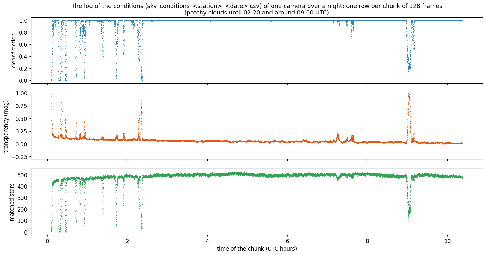

On a night with patchy clouds (above), the clouds are flagged where the matched filter had the most candidates
(until 02:20 UTC and around 09:00 UTC), and 0.7–0.8% of the sky is flagged on clear sky.


## What is processed

**Inputs.**

- Video files (`.vid`, `.mkv`, `.mp4`, `.avi`, `.mov`) and directories of FITS frames (one frame per file, with the
  time of the frame in `DATE-OBS`; each directory is one input). FF files are skipped: the frames themselves are
  needed.
- On the command line, an input with a `matched_filter_done.json` in its output directory is skipped (`--force`
  processes it again).
- In the monitor, an input is processed by the matched filter only if a chunk of it has at least `ff_min_stars`
  stars (as for the normal detection).

**Within an input.**

| What | Selected by |
|---|---|
| Frames | All frames, in blocks of 256; the frames of the chunks on clouded sky are masked region by region |
| Pixels | Not on bright stars, bright rows and columns, trails, the border, the user mask or clouded regions |
| Motions | Up to `mf_ang_vel_max` (in degrees per second, converted to px per frame); larger motions on coarser bins |
| Candidate tracks | The 300 strongest (`mf_max_tracks`), with at least 3 hits and a displacement of 3 FWHMs |
| Detections | Significance of at least 12 in both tests, a point source, at least 20 frames, at least 6 measurements on clear sky |
| Measurements | On clear sky, with an amplitude of at least 3 times its error and a position error within the limit |

**Outputs.** An FTPdetectinfo with a row per frame of every detection, recalibrated with the platepar, the CALSTARS,
the done file; the clear-sky reference and the log of the conditions of the camera (see [Output](#output)).


## Output

The detections are written as an FTPdetectinfo (the suffix `mf`) with a row for every frame of a detection:

| Column | Meaning |
|---|---|
| Frame | Frame number. The positions of faint objects are measured on several frames together and interpolated |
| Col, Row | Position (px), combined along the track (see Measurement) |
| RA, Dec, Azim, Elev, Mag | From the recalibrated platepar, as for the normal detection |
| Inten | Background-subtracted sum of the pixels of the object in this frame, on the scale of the CALSTARS intensities |
| Bcknd | Background level at the object |
| SNR | Intensity over its noise in this frame |
| NSatPx | Number of saturated pixels in the frame; at least 1 for spilled charge (the magnitude is then a lower limit of the brightness) |

`matched_filter_done.json` next to it lists every candidate track with its significance, the PSF sigma, the
aperture correction of the intensities, the number of candidate tracks which were not measured
(`tracks_dropped`, see `mf_max_tracks`), the clear fraction of the sky (`clear_sky_fraction`), the frames and
detections removed on clouded sky (`cloud_frames_removed`, `cloud_detections_removed`), and the processing time of
every step.

In the output directory of the camera (the monitor) or of the run (the command line):

- `sky_reference_<station>.npz`: the clear-sky reference of the stars (see [Clear sky](#clear-sky)),
- `sky_conditions_<station>_<YYYYMMDD>.csv`: the log of the conditions of every chunk.


## Running it

### In the monitor, after the normal detection

Add to the config:

```
[MatchedFilter]
mf_enable: true
```

After the normal detection of a file, the worker runs the matched filter on the same frames and writes its
results to a `matched_filter` directory in the results directory of the file (like the normal detection, it
is skipped when the file has fewer than `ff_min_stars` stars):

- `FTPdetectinfo_<...>_mf.txt`, recalibrated with the platepar (RA/Dec and magnitudes),
- `CALSTARS_<...>_mf.txt`, the platepar and the recalibrated platepars,
- `matched_filter_done.json`.

The night report merges the detections of all files into
`<night directory>/matched_filter/FTPdetectinfo_<night>_mf.txt`. The rest of the report (stacks, archive,
upload) only uses the normal detections. A failure of the matched filter is logged and doesn't fail the
file.

### In the monitor, instead of the normal detection

With `mf_replace_detection: true` (and `mf_enable: true`), the normal detection is not run: the stars are
extracted, and the detections of the matched filter are the results of the file (its FTPdetectinfo, CALSTARS,
recalibration, night report, archive and upload), with the done file `matched_filter_done.json` in the results
directory and no `matched_filter` directory. Objects moving more than `mf_ang_vel_max` are then not detected.

### On files or directories, e.g. during the day

```
python -m RMS.MatchedFilterDetection /path/to/night/ -c .config -p platepar_cmn2010.cal \
    --dark bias.png --flat flat.png -o /path/to/output
```

The inputs are video files (e.g. `.vid`, `.mkv`) and directories of FITS frames (one frame per file, with the
time of the frame in `DATE-OBS`; the frame rate is taken from the config), each directory being one input.
Every input file gets a directory in the output directory with the same files as above. Files which already
have a `matched_filter_done.json` are skipped, so an interrupted run can simply be started again (`--force`
processes them again). A file which fails is logged and the others are processed; the exit code is 1 if any
file failed. At the end, the detections of all files are merged into
`FTPdetectinfo_<output directory name>_mf.txt` in the output directory, which also holds the clear-sky reference
and the log of the conditions. Without `-p` (or with `--no-stars`) there is no recalibration and no sky quality.

Options: `--gpu auto|on|off`, `--threads N`, `--no-velocity-search` (the runs of 8 and 16 frames search only the
motions within one grid step of zero, the runs of 32 frames as usual: small motions only), `--no-stars` (no star
extraction, no recalibration and no sky quality, faster).

### Processing time and the GPU

The search runs on an NVIDIA GPU when numba can use CUDA (`mf_gpu: auto`, the default). This needs the
`numba-cuda` package for the installed CUDA version, e.g. `pip install "numba-cuda[cu12]"`; the log says
`(GPU)` next to the number of motions when it is used. The results are the same on the CPU and the GPU.

Measured on 10-minute 512x512 `.vid` files (32 FPS, 19,280 frames):

| | Matched filter per file |
|---|---|
| GPU (RTX 6000 Ada), one file at a time, without star extraction | 2.1 min |
| CPU only, 8 threads (`mf_threads: 8`), one file at a time | 3.9 min |
| GPU, three files at a time (6 threads each), with star extraction and recalibration | 3-4.5 min |

The CPU search is limited by memory access, so more than about 8 threads per worker doesn't help. With several
workers, set `mf_threads` to the number of CPU cores divided by the number of workers. Memory: about 2 GB per
worker in addition to the normal processing. The sky quality takes about 1 s per minute of frames; on clouded
sky it makes the matched filter faster, as the clouded regions are not searched.


## Tests

On recorded 512x512 frames (9° field of view, 32 FPS) with objects added to them, with the PSF of the camera:

- Found from about 1.5 times the noise per frame in the brightest pixel; about 2 magnitudes fainter than the
  normal detection over the whole range of motions of the search.
- Position errors: 0.03-0.1 px for bright objects, 0.1-0.25 px at the faint limit (larger for faint objects
  which move very little).
- Photometry: within a few percent of the flux, also in the frames of short brightenings and between them.
- Objects whose brightness changes (smoothly, in short brightenings, or only brightenings with nothing between
  them): found down to brightenings every 0.5 s.
- Crossing objects, crowded fields, objects passing bright stars, saturated objects: found and measured.
  Parallel objects closer than about 6 px are confused.
- No false detections in these tests; on recorded data the thresholds keep noise and star residuals below the
  significance limit, and the structures of thin drifting clouds are rejected by their shape.

On recorded data the matched filter finds nearly all the detections of the normal detection within its range of
motions (except very short ones and ones at the image border), and a comparable number of fainter objects.

Clear sky, on recorded one-minute samples and a night of two cameras:

- Clear sky: the same detections with and without the sky quality.
- An arriving cloud: the candidate tracks drop from 300 to 64 and the processing from 21 to 12 s, with the same
  detections; a detection crossing a patch of lit haze, and the whole field under thick clouds, are left out.
- A cloud of 0.3 mag fixed over a region during a whole 10-minute input: flagged in all of its area with the
  clear-sky reference (1-15% without it).
- On clear sky, 0.7-0.8% of the grid cells are flagged (mostly at the image edges), and 1.2-2.4% of the measurements
  of the normal detections and none of the matched filter.
- Processing the inputs of a night in time order or shuffled gives the same result.


## Settings

All settings are in the `[MatchedFilter]` section, see the comments in `.config`. The ones to know:

| Setting | Default | Meaning |
|---|---|---|
| `mf_enable` | false | Run in the monitor after the normal detection |
| `mf_replace_detection` | false | With mf_enable, the matched filter replaces the normal detection in the monitor |
| `mf_ang_vel_min`, `mf_ang_vel_max` | 0.01, 2.0 | Range of the motion of the objects (degrees per second). The search cost grows with the square of the largest |
| `mf_run_frames`, `mf_slow_run_frames` | 8, 16; 32 | Frames of the runs searched for all motions, and of the runs for small motions |
| `mf_threshold` | 5.0 | Threshold of the search (sigma of the maximum over the motions) |
| `mf_track_significance` | 12.0 | Minimum significance of a detection |
| `mf_min_frames` | 20 | Minimum duration of a detection (frames) |
| `mf_min_centroids` | 6 | Minimum number of measurements of a detection (on clear sky) |
| `mf_max_pos_error` | 0.5 | Target position error of a measurement (px): sets the frames per position; measurements up to twice this are accepted |
| `mf_max_measure_frames` | 8 | Most frames combined into one position |
| `mf_smooth_frames` | 64 | Positions combined along the track over +- this many frames, 0 disables it |
| `mf_clip` | 10 | The normalized frames are clipped to +- this before the search |
| `mf_link_max_gap` | 96 | Largest gap (frames) between strong hits of a track |
| `mf_tier_speed`, `mf_max_bin` | 2.0, 8 | Tiers of the search: larger motions on coarser bins (the motions per tier in binned px per frame), 0 disables them |
| `mf_trail_level` | 25 | Rows and columns of sources brighter than this in a frame (in the noise of a pixel) are left out of the search, 0 disables it |
| `mf_max_tracks` | 300 | Most candidate tracks measured per file (the strongest), bounds the time in bad conditions |
| `mf_cloud_filter` | true | Leave out the clouded sky (needs the stars and the platepar) |
| `mf_cloud_max_offset` | 0.15 | Largest local dimming of the stars on clear sky (mag) |
| `mf_cloud_min_matched` | 30 | Smallest number of matched stars of the chunk the platepar is fitted on, for the sky quality |
| `mf_psf_sigma` | 0 | PSF sigma (px), 0 measures it on the stars |
| `mf_saturation_level` | 0 | Saturation level of the raw frames (ADU), 0 = 98% of the bit range |
| `mf_gpu` | auto | Use the GPU: auto, on, off |
| `mf_threads` | 0 | CPU threads, 0 = all cores |


## Limits

- Objects moving more than `mf_ang_vel_max` or shorter than `mf_min_frames` are not detected; the normal
  detection finds the bright ones.
- Objects within `mf_edge_margin` (8 px) of the image border are not measured.
- Objects closer than about 6 px moving in parallel are confused, and a faint object moving with a much brighter one
  within about 20 px is dropped as its shadow.
- Single-frame brightenings more than about 2 s apart, with nothing visible between them, are not linked.
- On clouded sky nothing is measured. The sky quality needs a platepar which fits the stars; with the first inputs
  of a camera (no clear-sky reference yet), a cloud which stays over the same region during a whole input is only
  found where it hides the stars.
- FF files are skipped: the frames themselves are needed.
