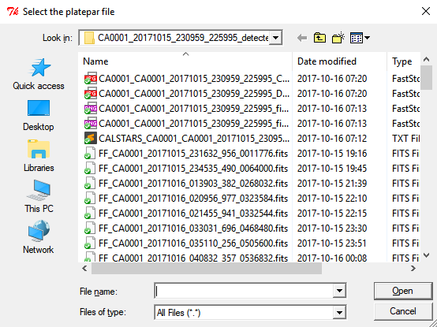
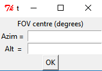
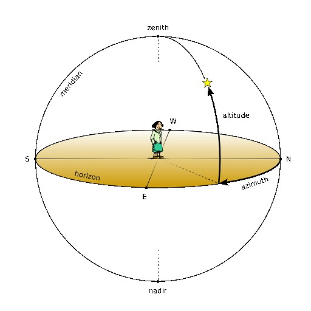
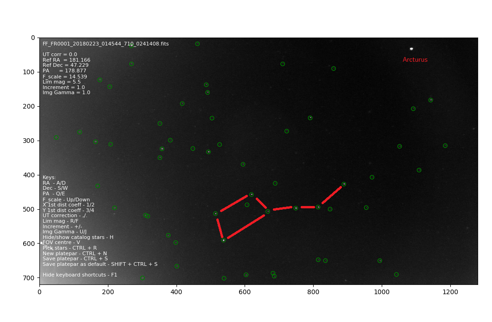
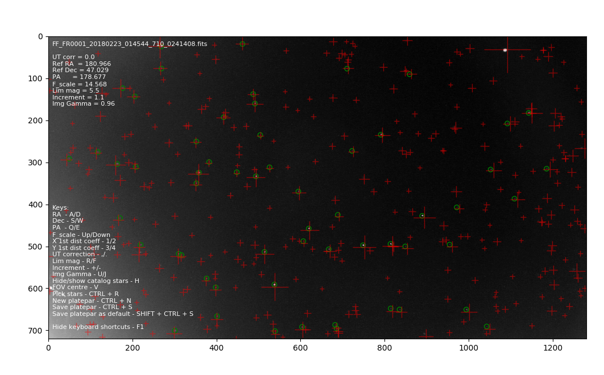
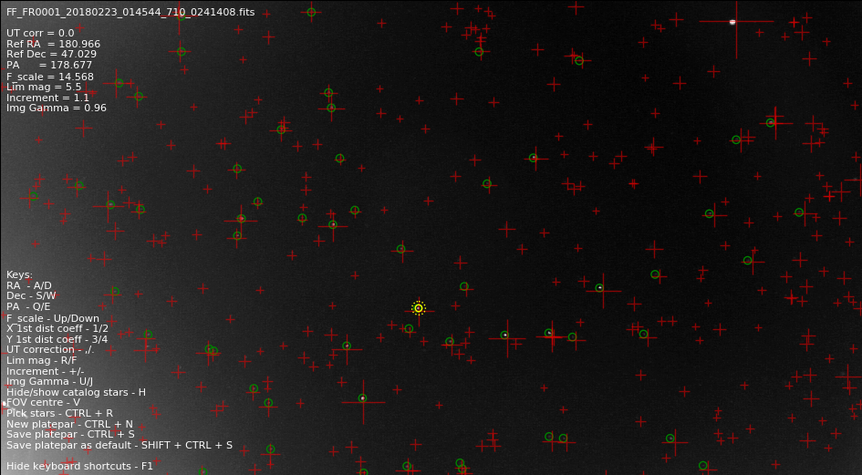
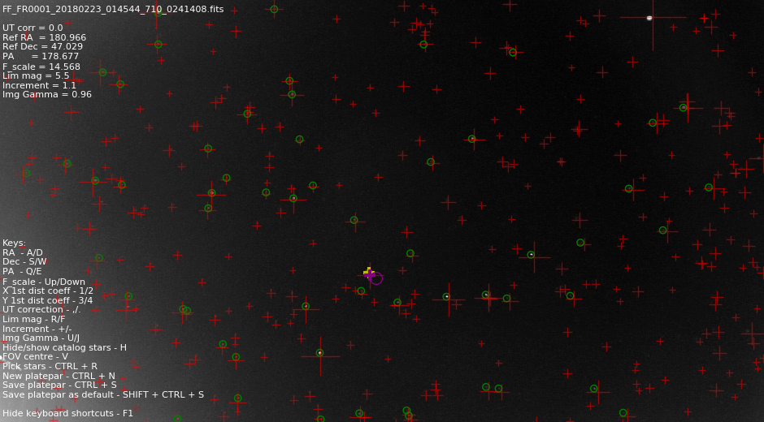
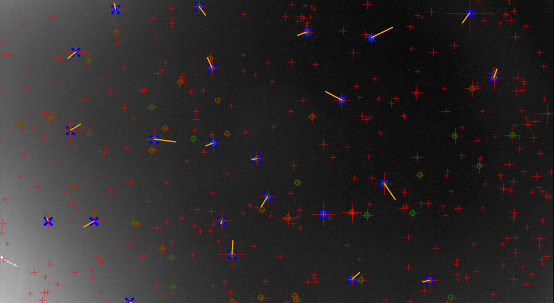
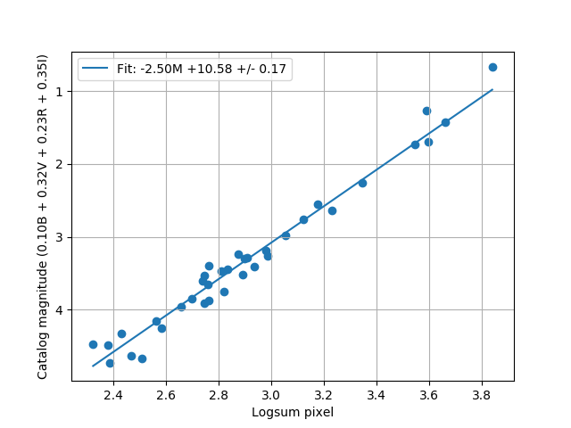

# Creating an initial astrometric plate with SkyFit

After collecting your first night of data, and assuming the night was clear, you will have your first detected meteors, congrats!

Now, the next very important step is to create an astrometric plate and do the photometric calibration. An astrometric plate is just a file which tells our software how to convert the positions of meteors from image coordinate (X and Y) to sky coordinates (right ascension and declination). This step is very important because these coordinates are used to estimate meteor trajectories, and in the end, calculate the orbit of the meteor.

The way to do this is to match the positions of the stars on images to their positions from the star catalog. Once this transformation is known, we can convert any image coordinates to the coordinates on the sky.


#### 1. Configuration

First, we need to make sure that the values in the configuration file are correct. Locate and open the ```.config``` configuration file, which is in the RMS root directory (probably ```~/RMS```). 

Under the section [System] configure the geographical location of your camera, you can either look up the values on (http://elevationmap.net) or use a GPS app on your phone:

- latitude - Latitude of your camera in decimal degrees, North latitudes are positive.
- longitude - Longitude of your camera, eastern longitudes are positive. NOTE: If you live West of the prime meridian, i.e. Western Europe, North or South America, your longitudes will be negative!
- elevation - Altitude above sea level in meters.

Under the section [Capture], configure an approximate field of view (FOV) of your camera:

- fov_w - Width of the camera's field of view in degrees.
- fov_h - Height of the camera's field of view in degrees.

If you are using a camera with a 1/3" 16:9 sensor (i.e. IMX225), here are some typical values of the field of view per different lenses (lens focal length - FOV width x FOV height)

- 2.8mm lens - 92x50 deg
- 4mm lens - 64x35 deg
- 6mm lens - 42x23 deg
- 12mm lens - 21x12 deg
- 25mm lens - 10x6 deg

If you are using a different lens or a sensor, you can calculate the field of view with the following formula: 

*FOV = 2\*arctan(d/(2\*f))* 

where *d* is the size of the sensor in the given directon (width or height), and *f* is the focal length of the lens.

For example, a 1/2" sensor has a width of 6.4mm, and when coupled with a 4mm lens its FOV width will be about 77 degrees. Its height is 4.8mm and it has a FOV height of around 62 degrees with the same lens.


#### 2. Locating the night folder

The second thing to do is to find one night with clear periods and (possibly) with some meteor detections. All data recorded by the RMS software will be stored in ```~/RMS_data```. We recommend that you use [CMN binViewer](https://github.com/CroatianMeteorNetwork/cmn_binviewer/) to view the data first.

In this example, the image files are located in ```~/RMS_data/ArchivedFiles/CA0001_20171015_230959_225995_detected```.


#### 3. Run SkyFit

Use the terminal to navigate to your root RMS directory (most probably ```~/source/RMS```) and from there run:

```
python -m RMS.Astrometry.SkyFit path/to/night/directory --config .
```

where ```path/to/night/directory``` is the location of the image files determined in the previous step, in this case ```~/RMS_data/ArchivedFiles/CA0001_20171015_230959_225995_detected```. The ```--config .``` option will use the config file that's in the directory instead of the default config file. This is very important because you want to use the correct geo coordinates for the calibration.

A file dialog will pop out, asking you to open an exiting platepar file. As we don't have a platepar yet, press 'Cancel'.




Next, a dialog asking you to input an approximate azimuth and altitude of the camera's field of view will appear:



**Azim**uth is the angle between due North and the centre of the field of view of your camera - it is very important that you first face North and then measure the angle towards the East. For example, if your camera is pointing North-East, the azimuth is 45°. On the other hand, if your camera is pointing South-West, the azimuth is 225°.

**Alt**itude is the angle between the horizon and the centre of the field of view of the camera. If you have pointed your camera straight up, towards the zenith, the altitude will then be around 90°, but the azimuth then loses meaning and can be any angle between 0 and 360.




#### 4. Recognize stars

Use arrow keys **<-- Left** and **Right -->** to cycle through images. Find an image which has clearly visible stars and has no clouds. **Green circles** are stars detected on the image using an automatci algorithm, but there might be some which were not automatically detected. You will also notice **red plusses** on the image, those are projected positions of catalog stars, and the projection is done by using the current astrometric parameters. The size of the catalog star marker is proportional to the brightness of the star, which can help you with identifying which star is which. You will notice that the stars on the image and the catalog stars do not match at all. Our goal is to tweak the astrometric parameters until they do match.

If the image is dark, **use U and J keys to change the image gamma.** You can press **CTRL + A** to automatically adjust the image levels.

First, cycle through images and see if the catalog stars follow the general direction of the movement of the image stars. For example, if your camera is rotated in any way, the movement of catalog stars will not match the movement of the image stars. This can be corrected for by changing the ***rotation*** using keys **Q** and **E**. Rotate the catalog stars until the stars start moving in approximately the same direction. If the stars are going in the opposite direction, the position angle should be 180 degrees.

If the position angle is large, you might find it tedious to change it by only 1 degree. You can use keys **+** and **-** to change the increment size. By default it is 1 degree, but change this according to your needs.

The next step is very important and can sometimes be quite difficult - you need to recognize the stars on the image, and match the stars. Use software like [Stellarium](http://stellarium.org/) to help you with that task. **Make sure the location in Stellarium is set to the location of the camera, and the time is set to the time of the image. Please note that the image time is in the UTC timezone.** Alternatively, you can press **CTRL + X** use the inbuilt feature that sends the image to astrometry.net and tries to get an approximate pointing. This might not always work.

In this example, the great dipper and the star Arcturus was visible on the image, telling us where the camera was pointing at the time:


Use keys **A** and **D** to change the azimuth, and **W** and **S** to change the elevation of the centre of the field of view until the image and the catalog stars are approximately matching. You might need to adjust the rotation as well. Adjust the step size (**+** and **-**) to fine tune the parameters.

You might notice that the scaling between the stars is off, as if the difference between the stars becomes larger with the distance from the centre. Then, you will need to adjust the scale using arrow keys **Up** and **Down**. You can adjust the step size (**+** and **-**) to fine tune the scale.

After this fine tuning, your fit should look something like this:




#### 5. Fitting astrometric parameters

Once the image and catalog stars are close enough, a more precise fit should be done. Press **CTRL + R** to activate the star matching mode. Here, you will have to manually match stars on the image to the catalog stars.

You can notice that there are two yellow circles around your mouse cursor now. You can change the size of the circles by scrolling. Click on a star you want to select, **making sure the star is completely inside the inner yellow circle**, and a **yellow +** will appear on the star. 



A **purple +** will appear next to the closest catalog star, which is probably the matching catalog star. If it is not, click on the correct catalog star, and the purple + will switch to it. Press **ENTER** when done, and a calibration star will be added to the list, its marker changing to a **blue X**.



You can press **H** to hide/show catalog stars which might help you with selecting good candidates for matching, and press **F1** to show/hide the help text on the screen. 

**You should strive to cover the whole image uniformley, and you need at least 14 stars for a good fit.** The more stars you have, the better! You can remove a star by right clicking on it.

When you have enough stars, press **CTRL + Z** to fit the plate. You will notice that the catalog stars will match the image stars better. **Press CTRL + Z** several more times until the solution stabilizes and doesn't change any more. Note **orange lines** emanating from the selected image stars. These lines are indicating the direction and the 100x magnitude of the fit residuals. **If there is a star with a line that is much longer than the average length of the others (by several lengths), remove that star by right clicking it and do the fit again (CTRL + Z).**

This is how the image should look like after successful fitting:


Take a look around the edges of the image and see if the fit is good everywhere. It is always a good idea to add a few more stars on the edges to make sure the fit is good there. Once you are happy with the plate, press **CTRL + S** to save it.


#### 6. Fitting photometric parameters

The second part is the photometric calibration which is used to convert the intensity of the meteor from image levels to stellar magnitudes. This is later used to estimate the mass of the meteor.

With all stars selected in the previous step, press **P** which will show the photometric fit. The points on the plot represent the logarithm of the pixel intensity sum vs. the star magnitude. They should show a linear correleation, and a line is fitted through them. You will notice a large scatter around the fitted line. If you look back on the image, you can notice that the star magnitude is plotted above the star in red text, and the offset is plotted below the star in white. The size of the text is proportional to the offset. Deselect (right click) the stars with the largest offet and do the photometric fit again (**P**). Repeat the process until the standard deviation of the fit is around +/- 0.2, or as best as you can do. You will also notice that the brightest stars tend to devaite the most. The reason is that they are saturating the image, and their real intensity is effectively being cut off by the upper limit of the sensor's dynamic range (level 255 for an 8-bit sensor). You might not get the fit below +/- 0.2, but do the best job you can.



Once the fit is satisfactory, press **CTRL + S** to save the calibration to the working directory.

**Finally, to use the plate as a default plate for your RMS installation, press CTRL + SHIFT + S.**


#### 7. Using the plate

Congratulations, you have successfully performed the calibration procedure!

If you have done the astrometry on another computer, you need to **copy the plate from the directory you were working in to the RMS source directory.** Astrometric parameters will be recalibrated automatically as long as the initial plate is close enough.

**If you move the camera, the plate will have to be redone!** Fortunately the only parameters that will have to be changed are the reference RA, Dec, and possibly the position angle, while all other parameters shouldn't change.
